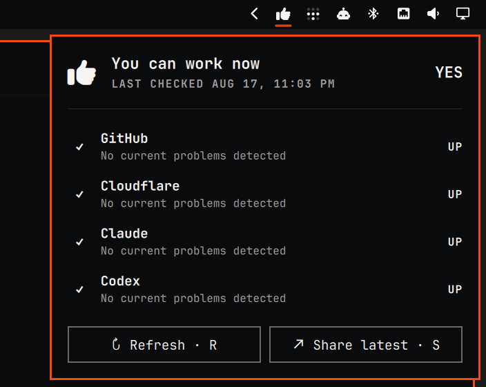

# Can I Work Now? for Omarchy

A monochrome Omarchy bar widget for the latest global [caniworknow.com](https://caniworknow.com) verdict.



The bar icon gives a quick yes/no signal. Open the panel for GitHub, Cloudflare, Claude, and Codex details, the global check time, manual refresh, and a permalink you can copy and share.

## Install

```bash
omarchy plugin add https://github.com/hemaaanth/caniworknow-omarchy-plugin --enable
```

The widget appears in the right section of the bar by default.

## Controls

- Click the bar icon to open or close service details.
- Right-click the bar icon to copy the latest permalink and show a confirmation notification.
- Middle-click the bar icon to refresh.
- Press `R` in the open panel to refresh and `S` to share.

Refresh and panel-share results appear inside their buttons, without in-progress flicker or desktop notifications. Right-click sharing uses a notification because the panel is closed and has no visible button feedback. The automatic refresh interval defaults to five minutes and cannot be set below five minutes.

## Settings

Open the Omarchy bar widget settings to choose:

- **Refresh interval:** 5–60 minutes.
- **Verdict icon:** monochrome thumb, check/cross, or Y/N.

## Network and system access

The plugin has no install or removal scripts. At runtime it:

- uses Omarchy's system `curl` at `/usr/bin/curl` to read `https://caniworknow.com/api/status`, with one retry for transient failures;
- posts an empty JSON object to `https://caniworknow.com/api/share` only when you share;
- uses Omarchy's system `wl-copy` at `/usr/bin/wl-copy` to place the returned permalink on your clipboard.

It does not collect credentials, write configuration, or run a background service outside Omarchy Shell.

## Update or remove

```bash
omarchy plugin update caniworknow.status
omarchy plugin remove caniworknow.status
```

Removal deletes the plugin through Omarchy's plugin manager; no separate cleanup is required.

## Troubleshooting

Omarchy normally reloads the widget after an install or update. If an existing shell instance keeps showing stale status after an update, restart the shell once:

```bash
omarchy restart shell
```

## Development

Validate the repository from its root:

```bash
omarchy plugin validate .
/usr/lib/qt6/bin/qmlformat -n CanIWorkNow.qml
```

## License

[MIT](LICENSE)
